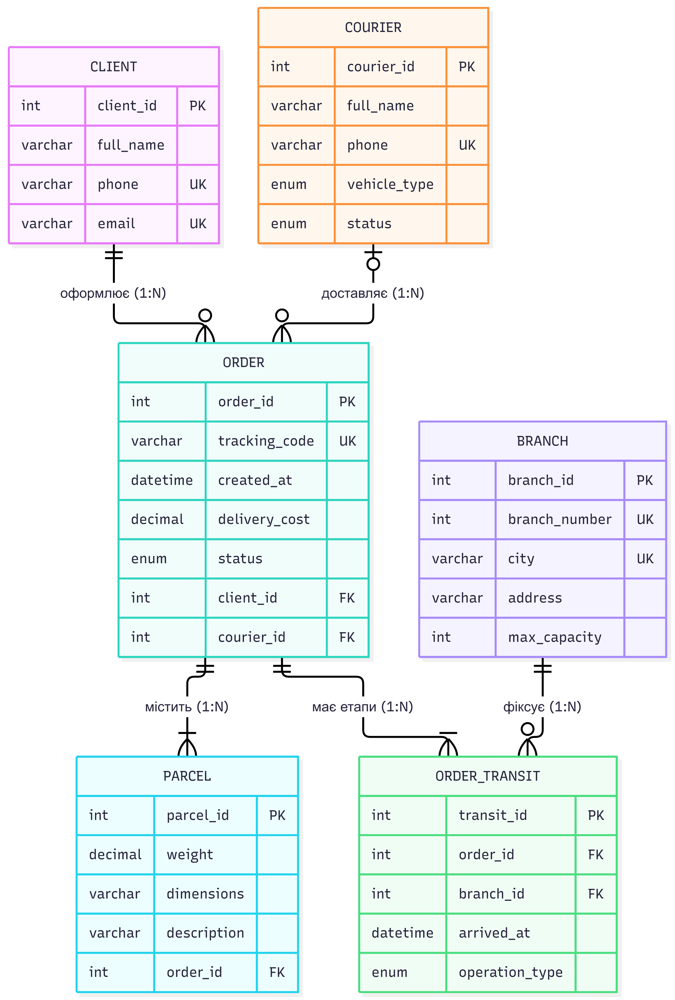

# Звіт з практичної роботи №2: Побудова ER-моделі предметної області

## 1. Предметна область
**Тема:** Служба доставки (продовження Практичної роботи №1).

## 2. Аналіз тексту вимог (Іменники та Дієслова)

На основі текстового опису системи виділено ключові іменники та дієслова і розподілено їх за категоріями ER-моделювання:

* **Кандидати у сутності (Іменники — об'єкти реального світу):**
  Клієнт, Кур'єр, Замовлення, Посилка (Відправлення), Відділення (Склад), Маршрут (Точка транзиту).
* **Кандидати в атрибути (Іменники — характеристики об'єктів):**
  ПІБ, номер телефону, електронна пошта, рейтинг, номер замовлення (ID), дата створення, вартість, статус доставки, вага, габарити, опис вмісту, адреса відділення, номер відділення, місткість, транспортний засіб, мітка часу.
* **Кандидати у зв'язки (Дієслова — взаємодії між об'єктами):**
  Створює (клієнт створює замовлення), доставляє / виконує (кур'єр доставляє замовлення), містить (замовлення містить посилку), приймає / видає (відділення обслуговує замовлення), проходить через (замовлення проходить через відділення).

---

## 3. Словник даних (Сутності, атрибути, домени та ключі)

Для моделі обрано **5 основних сутностей** та **1 асоціативну (проміжну) сутність**:

### 1. Клієнт (`Client`)
| Атрибут | Домен / Тип даних | Опис та обмеження | Ключ |
| :--- | :--- | :--- | :--- |
| `client_id` | Ціле число (`INT`) | Унікальний ідентифікатор клієнта (`> 0`, `NOT NULL`) | **PK** (Первинний), Кандидатний |
| `full_name` | Рядок (`VARCHAR(100)`) | ПІБ клієнта (`NOT NULL`) | — |
| `phone` | Рядок (`VARCHAR(15)`) | Номер телефону у форматі `+380...` (`UNIQUE`, `NOT NULL`) | Кандидатний (альтернативний) |
| `email` | Рядок (`VARCHAR(100)`) | Електронна пошта (`UNIQUE`) | Кандидатний (альтернативний) |

### 2. Кур'єр (`Courier`)
| Атрибут | Домен / Тип даних | Опис та обмеження | Ключ |
| :--- | :--- | :--- | :--- |
| `courier_id` | Ціле число (`INT`) | Унікальний ідентифікатор кур'єра (`> 0`, `NOT NULL`) | **PK** (Первинний), Кандидатний |
| `full_name` | Рядок (`VARCHAR(100)`) | ПІБ кур'єра (`NOT NULL`) | — |
| `phone` | Рядок (`VARCHAR(15)`) | Контактний телефон (`UNIQUE`, `NOT NULL`) | Кандидатний (альтернативний) |
| `vehicle_type`| Перелік (`ENUM`) | Тип транспорту: `'піший'`, `'авто'`, `'мото'` (`NOT NULL`) | — |
| `status` | Перелік (`ENUM`) | Поточний статус: `'вільний'`, `'на маршруті'`, `'неактивний'` | — |

### 3. Відділення (`Branch`)
| Атрибут | Домен / Тип даних | Опис та обмеження | Ключ |
| :--- | :--- | :--- | :--- |
| `branch_id` | Ціле число (`INT`) | Унікальний ID відділення (`> 0`, `NOT NULL`) | **PK** (Первинний), Кандидатний |
| `branch_number`| Ціле число (`INT`) | Номер відділення у місті (`> 0`, `NOT NULL`) | Кандидатний (у парі з `city`) |
| `city` | Рядок (`VARCHAR(50)`) | Назва населеного пункту (`NOT NULL`) | Кандидатний (у парі з `branch_number`) |
| `address` | Рядок (`VARCHAR(150)`) | Фізична адреса відділення (`NOT NULL`) | — |
| `max_capacity`| Ціле число (`INT`) | Максимальна місткість посилок (`> 0`) | — |

### 4. Замовлення (`Order`)
| Атрибут | Домен / Тип даних | Опис та обмеження | Ключ |
| :--- | :--- | :--- | :--- |
| `order_id` | Ціле число (`INT`) | Унікальний номер замовлення (`NOT NULL`) | **PK** (Первинний), Кандидатний |
| `tracking_code`| Рядок (`VARCHAR(20)`) | ТТН / трек-номер посилки (`UNIQUE`, `NOT NULL`) | Кандидатний (альтернативний) |
| `created_at` | Дата і час (`DATETIME`)| Дата та час оформлення (`NOT NULL`) | — |
| `delivery_cost`| Дійсне число (`DECIMAL(8,2)`)| Вартість доставки у грн (`>= 0`) | — |
| `status` | Перелік (`ENUM`) | `'створено'`, `'в дорозі'`, `'у відділенні'`, `'доставлено'`, `'скасовано'` | — |
| `client_id` | Ціле число (`INT`) | Посилання на клієнта-відправника (`NOT NULL`) | **FK** (Зовнішній ключ) |
| `courier_id` | Ціле число (`INT`) | Посилання на призначеного кур'єра (`NULL` до призначення) | **FK** (Зовнішній ключ) |

### 5. Посилка (`Parcel`)
| Атрибут | Домен / Тип даних | Опис та обмеження | Ключ |
| :--- | :--- | :--- | :--- |
| `parcel_id` | Ціле число (`INT`) | Унікальний ідентифікатор місця/посилки (`NOT NULL`) | **PK** (Первинний), Кандидатний |
| `weight` | Дійсне число (`DECIMAL(6,2)`)| Вага у кілограмах (`> 0`, `NOT NULL`) | — |
| `dimensions` | Рядок (`VARCHAR(30)`) | Габарити Д×Ш×В у см (напр., `'40x30x20'`) | — |
| `description` | Рядок (`VARCHAR(200)`) | Опис вмісту посилки (`NOT NULL`) | — |
| `order_id` | Ціле число (`INT`) | Посилання на замовлення, до якого входить посилка (`NOT NULL`) | **FK** (Зовнішній ключ) |

### 6. Етап маршруту / Трекінг (`Order_Transit` — проміжна сутність)
| Атрибут | Домен / Тип даних | Опис та обмеження | Ключ |
| :--- | :--- | :--- | :--- |
| `transit_id` | Ціле число (`INT`) | Унікальний ID запису маршруту (`NOT NULL`) | **PK** (Первинний) |
| `order_id` | Ціле число (`INT`) | Посилання на замовлення (`NOT NULL`) | **FK**, частина складеного кандидатного ключа |
| `branch_id` | Ціле число (`INT`) | Посилання на транзитне відділення (`NOT NULL`) | **FK**, частина складеного кандидатного ключа |
| `arrived_at` | Дата і час (`DATETIME`)| Час прибуття у відділення (`NOT NULL`) | Частина складеного кандидатного ключа |
| `operation_type`| Перелік (`ENUM`) | `'прийнято'`, `'сортування'`, `'відправлено'`, `'видано'` | — |

---

## 4. Таблиця зв'язків між сутностями

| Сутність 1 | Зв'язок (Дія) | Сутність 2 | Ступінь | Кардинальність | Обов'язковість участі |
| :--- | :--- | :--- | :--- | :--- | :--- |
| **Клієнт** | оформлює | **Замовлення** | `1:N` | `1..1` до `0..N` | Для Клієнта — необов'язкова (`0..N`), для Замовлення — обов'язкова (`1..1`, замовлення не існує без клієнта) |
| **Кур'єр** | доставляє | **Замовлення** | `1:N` | `0..1` до `0..N` | Необов'язкова з обох боків: кур'єр може ще не мати замовлень (`0..N`), а нове замовлення може ще не мати призначеного кур'єра (`0..1`) |
| **Замовлення**| містить | **Посилка** | `1:N` | `1..1` до `1..N` | Обов'язкова з обох боків: замовлення має містити хоча б одну посилку (`1..N`), а кожна посилка належить рівно одному замовленню (`1..1`) |
| **Замовлення**| проходить через | **Відділення** | `M:N` | `1..N` до `0..N` | Замовлення проходить мінімум через 1 відділення (`1..N`), а нове відділення може ще не мати жодного замовлення (`0..N`) |

---

## 5. Пояснення зв'язку M:N та його розв'язання

У предметній області «Служба доставки» виникає класичний зв'язок **«багато-до-багатьох» (`M:N`)** між сутностями **Замовлення (`Order`)** та **Відділення (`Branch`)**:
* Одне замовлення під час доставки зазвичай проходить через **кілька відділень** (відділення відправки → транзитний сортувальний термінал → відділення видачі).
* Одночасно одне відділення обслуговує та зберігає **багато різних замовлень**.

**Рішення:** 
Реляційні бази даних не підтримують прямий зв'язок `M:N` між таблицями, тому для його реалізації вводиться **проміжна (асоціативна) сутність — `Етап маршруту / Трекінг` (`Order_Transit`)**. 
Вона розбиває один зв'язок `M:N` на два зв'язки типу `1:N`:
1. `Order (1) ──< (0..N) Order_Transit`
2. `Branch (1) ──< (0..N) Order_Transit`

Окрім зовнішніх ключів (`order_id` та `branch_id`), ця проміжна сутність зберігає власні корисні атрибути факту переміщення: точний час прибуття посилки на склад (`arrived_at`) та тип операції (`operation_type`).

---

## 6. ER-діаграма (Нотація Crow's Foot)

